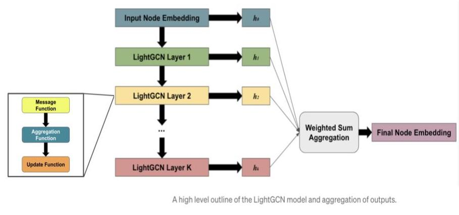
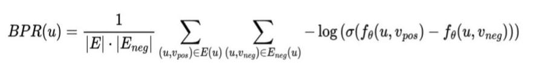

# GNN-eCommerce
### Ecommerce Recommender using GNN

## Introduction

Purpose of this project is to build a recommender system for eCommerce sites/apps. 
The recommender is based on recent research paper, by [He et al. 2020](https://arxiv.org/abs/2002.02126). It applied Graph Neural Network on the multi-form user-product interactions business problem. 

This system consists of:
1. A Graph Neural Network model, LightGCN. This model trains on historical consumer events and makes product recommendations to consumers real time.
2. A data pipeline managed using Git and DVC to prepare train/validation/test datasets from raw data 
3. A machine learning pipeline managed using Git and DVC to train and evaluate the model.
4. An online model serving architecture: an api server and a model server to serve inference requests from online stores.

## Use cases

This system is used for recommending products to consumers who have buying or viewing history. 

For new customers who have no activity records, it should be handled by other models, e.g. Popularity recommender, Random recommender.

This model can also be ensembled with a content filtering recommender, which recommends based on a consumers in-session activity.

## Dataset and [Data pipline](notebooks/1.data_preprocessing.ipynb)
The dataset used to train and evaluate the model is eCommerce Events History in Cosmetics Shop from [Kaggle](https://www.kaggle.com/datasets/mkechinov/ecommerce-events-history-in-cosmetics-shop).
It contains 20 million events of 1.6 million consumers interacted with 54 thousand items during 5 months. There are four event types: view, add to cart, remove from cart and purchase. The local "checked out" version is in [directory](data/raw/cosmetic-shop-ecommerce-events).

These events are transformed into graph representation in order to fit into a GNN. Consumers and items are graph nodes. Events are graph edges between consumer and item nodes.
An edge has a weight, which is determined by the event types.

There are more than one way to determine the edge weight. Here is an example:
1. assign a weight to individual event types: view = 0.01, cart = 0.1, remove from cart = -0.19, purchase = 1.0
2. sum the wights of all events between a consumer-product pair to be raw edge weight.
3. Adjust raw edge weight into proper range (between 0 and 1).

Processed data is persisted in [directory](data/preprocessed/u_i_weight_0.01_0.1_-0.09.csv).
DVC is used for version control and managing lineage. Remote repository is on Google Drive. 

## [Model Architecture](src/lightgcn.py)
Model architecture is LightGCN, based on research paper mentioned above.

## Evaluation Metric
Mean Average Recall@K(MARK) is the evaluation metric.

## [Training Algorithm](src/train_lightgcn.py)

The whole dataset is split into train/ val/ test. [Prepare train/val/test dataset](src/utils_v2.py)

Loss function is BPR Loss:

It takes the embeddings of a user node, a positive item node and a negative item node to calculate the relative score, with the objective of minimizing the distance between user and positive item and maximizing the distance between user and the negative item.

Mini-batches are created by random sampling from the training set (user, positive item, negative item) tuples.

A GPU with 24GB of memory is required. It takes about 24 hours to train the model. 

**Tunable hyper parameters**: 
number of LGConv layers (3, 4, 5), 
dimension of node embeddings (64, 80, 90)
learning rate

### Save best model
The training process keeps track of best model and related metadata. Saves the best model and its metadata in [directory](model-checkpoints/).

## [Inference the model](src/inference_lightgcn.py)
The inference process loads saved best model and its metadata, recommend topK products, compute `MARK`, compute paths between users and recommended products using networkX `shortest_path`, and persist the result in [directory](model-recommendations).

Persisted inference result can be plot out: [Result explainability](notebooks/plot_inference_result.ipynb), [Plot utils](src/plot.py)

## MLE Software Architecture

This is the MLOps stack I use. The blue box on the left is the data processing pipeline. At the end of the pipeline is graph representations of the e-commerce events. Branching and versioning of the pipeline code together with the resulting graph is done with Github & DVC.

The green box on the right hand side is the iterative process of model development and experiments. It involves experiments of different model training methodologies and hyperparameters tuning, The trained model are stored and versioned together with the hyperparameters and training log in DVC.

The pink box at the bottom is production deployment. The model is served using TorchServe.

## Production Infrastructure

When a customer visits a web/ mobile app, an API is called with the customer id sent. 
The API server forwards the request to TorchServe model server. TorchServe uses the consumer and items embeddings to come up with the highest score items and send them back to the API server.

The customer online events database receives near real time feeds from the ecommerce system via message streaming. This part is not in scope of the project.

The model needs to be retrained regularly so that it is up-to-date with new activities. The auto retraining is also not in scope for this project.

## Future Work
The current model is optimized on the probability of buying. There may be other optimization metric such as revenue, etc. We can try ensemble of models with different optimization metrics.

Another possibility is to add price bucket in the graph.

Groping events in session is also worth exploring.

## [Project Pitch Slides](doc/GNN-based%20RecSys.pdf)

